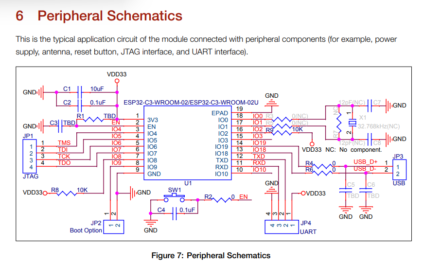

# Blackmagic Probe for ARM running on esp32 hardware

Based on the ESP8266 black magic port, only provides SWD ARM Cortex-M Debug Interface

It provides a wifi based, debug probe for ARM i.e. ST32L1 cortex processors
https://github.com/markrages/blackmagic/tree/a1d5386ce43189f0ac23300bea9b4d9f26869ffb/src/platforms/esp8266


# Changes
 I merged JTAG support for riscv-esp32c3 however this is not tested.


 If you connect an STM32 board and put it in boot mode, then you might be able to query some information 
 with uart_scan.

 You need to connect the UART pins


# Merges latest from black magic main repo 
Sept 23 2023

# Platform IO
The latest changes are tested with ESP32-C3

I also managed to build with an esp32-S3

Then I had to preform a workaround, by setting board to
board = esp32s3-qio

If you have problems, Use Platform, Run Menuconfig
Here you can change settings,
Component config → ESP System Settings ,  Initialize Task Watchdog Timer on startup
Dsiable the watchdog or find a way to prevent it from triggereing.

# Up to date BMP
This repository is not updated with latest changes in BMP
This other repository contains the latest version of BMP source https://github.com/Ebiroll/blackmagic

In order to build this repository in linux, do.
```
      > . ~/esp/esp-idf/setup.sh
      > cd src/platforms/esp32
      #Check the platform.h files amd make sure that the pins are OK.
      # check main.c for password and SSID of your wifi
      #Run build script.
      > build-esp32.sh
      #Upload the
```
However espressif might have changed this behaviour and it is might not be possible to build now.
You must also pull the changes from upstream repo.


# Status

Now it seems to work, I tried a RAK811 target. And the targets found in my arm_test repo
The pins are defined here,
http://docs.rakwireless.com/en/RAK811%20TrackerBoard/Software%20Development/RAK811%20TrackerBoard%20User%20manual%20V1.1.pdf

This is the debug compiled source code I use,
https://github.com/Ebiroll/RAK811_BreakBoard

So
```
GND on ESP32 connects to GND on the RAK board, opposite to the boot pins
PIN 8 on ESP32-C3 connects to SWD_CLK
PIN 10 on ESP32-c3 connects to SWD_TMS
```
Pins are changed in platform.h

```
I (3119) event: sta ip: 192.168.1.117, mask: 255.255.255.0, gw: 192.168.1.1
I (3119) blackmagic: Connected to AP
I (19827) gpio: GPIO[8]| InputEn: 0| OutputEn: 1| OpenDrain: 0| Pullup: 0| Pulldown: 0| Intr:0 
I (19827) gpio: GPIO[10]| InputEn: 0| OutputEn: 1| OpenDrain: 0| Pullup: 0| Pulldown: 0| Intr:0 
```


# Start the debugger,
```
arm-none-eabi-gdb .pioenvs/rak811/firmware.elf

target  extended-remote 192.168.1.125:2345

(gdb) monitor help

(gdb) monitor swdp_scan
Target voltage: not supported
Available Targets:
No. Att Driver
 1      STM32L1x

https://github.com/blacksphere/blackmagic/wiki/Frequently-Asked-Questions

(gdb) attach 1

```

Works like charm.

# Trace SWO
It is possible to use trace swo if you configure it to use UART mode and 115200.
You must also define thses in platform.h.

```
#define PLATFORM_HAS_TRACESWO 1
#define TRACESWO_PIN 7
// Workaround for driver, and to try STM info polling,
// It also allows you to use the UART from the debugger.
#define TRACESWO_DUMMY_TX 6
```
    
Note that the debugger needs to be attached in order to get output on the serial device.
Here is an example of how to set up the swo for UART mode trace,
https://github.com/Ebiroll/beer_tracker/blob/master/RAK811-Tracker/src/swo.c
Add this,
```
#define CPU_CORE_FREQUENCY_HZ 16000000 /* CPU core frequency in Hz 32Mhz */
   SWO_Init(0x1, CPU_CORE_FREQUENCY_HZ);
```

Here are some more useful information ow what is possible.
https://github.com/orbcode/orbuculum

To start trace thead, do
```
(gdb) monitor traceswo 9600
```


# Quicker download
```
arm-none-eabi-gdb .pioenvs/rak811/firmware.elf -ex 'target  extended-remote 192.168.1.136:2345'

(gdb) monitor swdp_scan
(gdb) attach 1
(gdb) load
(gdb) b main
(gdb) c


``` Succesfull boot
ESP-ROM:esp32c3-api1-20210207
Build:Feb  7 2021
rst:0x1 (POWERON),boot:0xd (SPI_FAST_FLASH_BOOT)
SPIWP:0xee
mode:DIO, clock div:1
load:0x3fcd5820,len:0x1704
load:0x403cc710,len:0x968
load:0x403ce710,len:0x2f68
entry 0x403cc710
I (30) boot: ESP-IDF 5.0.2 2nd stage bootloader
I (30) boot: compile time Aug 31 2023 08:03:44
I (30) boot: chip revision: v0.3
I (33) boot.esp32c3: SPI Speed      : 80MHz
I (38) boot.esp32c3: SPI Mode       : DIO
I (43) boot.esp32c3: SPI Flash Size : 4MB
I (47) boot: Enabling RNG early entropy source...
I (53) boot: Partition Table:
I (56) boot: ## Label            Usage          Type ST Offset   Length
I (64) boot:  0 nvs              WiFi data        01 02 00009000 00006000
I (71) boot:  1 phy_init         RF data          01 01 0000f000 00001000
I (79) boot:  2 factory          factory app      00 00 00010000 00100000
I (86) boot: End of partition table
I (90) esp_image: segment 0: paddr=00010020 vaddr=3c0b0020 size=2aa68h (174696) map
I (126) esp_image: segment 1: paddr=0003aa90 vaddr=3fc91600 size=02a40h ( 10816) load
I (129) esp_image: segment 2: paddr=0003d4d8 vaddr=40380000 size=02b40h ( 11072) load
I (134) esp_image: segment 3: paddr=00040020 vaddr=42000020 size=aea44h (715332) map
I (255) esp_image: segment 4: paddr=000eea6c vaddr=40382b40 size=0e9b8h ( 59832) load
I (272) boot: Loaded app from partition at offset 0x10000
I (272) boot: Disabling RNG early entropy source...
I (283) cpu_start: Unicore app
I (284) cpu_start: Pro cpu up.
I (292) cpu_start: Pro cpu start user code
I (292) cpu_start: cpu freq: 160000000 Hz
I (293) cpu_start: Application information:
I (295) cpu_start: Project name:     c3_blackmagic
I (301) cpu_start: App version:      1
I (305) cpu_start: Compile time:     Aug 31 2023 08:03:31
I (311) cpu_start: ELF file SHA256:  000bed43aadaae46...
I (317) cpu_start: ESP-IDF:          5.0.2
I (322) cpu_start: Min chip rev:     v0.3
I (327) cpu_start: Max chip rev:     v0.99 
I (332) cpu_start: Chip rev:         v0.3
I (337) heap_init: Initializing. RAM available for dynamic allocation:
I (344) heap_init: At 3FC98F40 len 000437D0 (269 KiB): DRAM
I (350) heap_init: At 3FCDC710 len 00002950 (10 KiB): STACK/DRAM
I (357) heap_init: At 50000020 len 00001FE0 (7 KiB): RTCRAM
I (364) spi_flash: detected chip: winbond
I (368) spi_flash: flash io: dio
I (372) sleep: Configure to isolate all GPIO pins in sleep state
I (378) sleep: Enable automatic switching of GPIO sleep configuration
I (385) app_start: Starting scheduler on CPU0
I (390) main_task: Started on CPU0
I (390) main_task: Calling app_main()
I (400) pp: pp rom version: 9387209
I (400) net80211: net80211 rom version: 9387209
I (410) wifi:wifi driver task: 3fca1d8c, prio:23, stack:6656, core=0
I (420) wifi:wifi firmware version: b2f1f86
I (420) wifi:wifi certification version: v7.0
I (420) wifi:config NVS flash: enabled
I (420) wifi:config nano formating: disabled
I (420) wifi:Init data frame dynamic rx buffer num: 32
I (430) wifi:Init management frame dynamic rx buffer num: 32
I (430) wifi:Init management short buffer num: 32
I (440) wifi:Init dynamic tx buffer num: 32
I (440) wifi:Init static tx FG buffer num: 2
I (450) wifi:Init static rx buffer size: 1600
I (450) wifi:Init static rx buffer num: 10
I (450) wifi:Init dynamic rx buffer num: 32
I (460) wifi_init: rx ba win: 6
I (460) wifi_init: tcpip mbox: 32
I (470) wifi_init: udp mbox: 6
I (470) wifi_init: tcp mbox: 6
I (470) wifi_init: tcp tx win: 5744
I (480) wifi_init: tcp rx win: 5744
I (480) wifi_init: tcp mss: 1440
I (490) wifi_init: WiFi IRAM OP enabled
I (490) wifi_init: WiFi RX IRAM OP enabled
I (500) phy_init: phy_version 970,1856f88,May 10 2023,17:44:12
I (540) wifi:mode : softAP (7c:df:a1:b4:91:45)
I (540) wifi:Total power save buffer number: 16
I (540) wifi:Init max length of beacon: 752/752
I (540) wifi:Init max length of beacon: 752/752
I (550) esp_netif_lwip: DHCP server started on interface WIFI_AP_DEF with IP: 192.168.4.1
I (560) blackmagic: wifi_init_softap finished. SSID:blackmagic password:sesam1234 channel:7
```


# C3 schematics for test of JTAG
